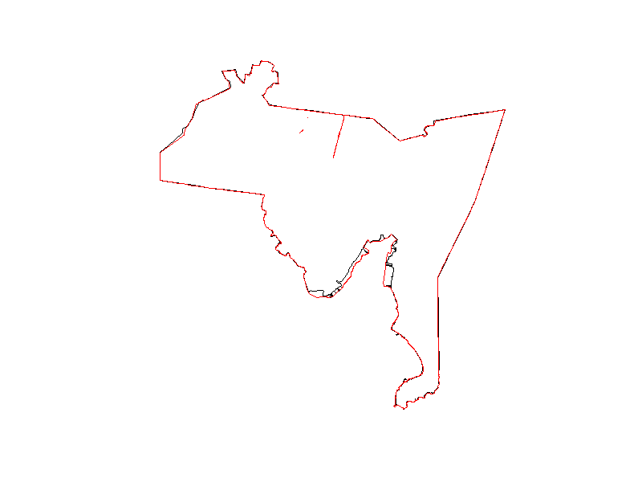

# newhaven_csi
Remake of the Community Severance Index for New Haven, Connecticut. Methodology based on *Development of a community severance index for urban areas in the United States: A case study in New York City* (Benavides et al, 2024) ([journal article](https://www.sciencedirect.com/science/article/pii/S0160412024001120?ref=pdf_download&fr=RR-2&rr=9387bb57b9c37f56), [GitHub repository](https://github.com/jaime-benavides/community_severance_nyc?tab=readme-ov-file)).

# Developments
- 05/01/2025
  - Change spatial context from New Haven neighborhoods shapefile with `sf::st_union` to town boundary shapefile sourced from Connecticut DEEP ArcGIS archive (https://deepmaps.ct.gov/datasets/CTDEEP::connecticut-and-vicinity-town-boundary-set/about?layer=1).
  - When plotted, the unioned neighborhoods (red) have a different border than the town boundary (black), which would result in a different spatial context and different values for interpolation to census block groups and calculation of environmental variables.

## scripts/
`a_00_initiate.R`
- Install and load required packages.
- Set home and input/output directories and Connecticut-specific coordinate reference system.
- Source at the beginning of each run script `source("scripts/a_00_initate.R")`

`a_01_prep_sld.R`
- Prepare spatial data from Smart Location Database.
- Input(s): `data/input/SmartLocationDatabase.gbd`
- Output(s): `data/output/a_01/sf_sld_variables_proj.rds`, `data/output/a_01/df_sld.rds`

`a_02_barrier_factor_prep.R`
- Prepare barrier factor variables.
- Input(s): `data/input/connecticut-latest.osm.pbf`, `data/input/FAF5Network/F5FNEWHAVEN.shp`
- Output(s): 

`a_03_query_traffic.R`
- Query US (AADT) and Connecticut (HPMS) traffic data from ESRI respoitories.
- Output(s): `data/output/a_03/sf_aadt_proj.rds`, `data/output/a_03/sf_ct_hpms_proj.rds`

`a_04_regrid_aadt.R`
- Regrid (interpolate) traffic intensity (counts) data to census block groups with local `regrid_ok()`.
- Input(s): `data/output/a_01/sf_sld_variables_proj.rds`, `data/output/a_03/sf_aadt_proj.rds`, `R/regrid_ok.R`
- Output(s): `data/output/a_04/sf_regrid_aadt_cbg.rds`

`a_05_regrid_hpms.R`
- Regrid (interpolate) traffic intensity (segements) data to census block groups with local `regrid_ok()`
- Input(s): `data/output/a_01/sf_sld_variables_proj.rds`, `data/output/a_03/sf_ct_hpms_proj.rds`, `R/regrid_ok.R`
- Output(s): `data/output/a_05/sf_regrid_hpms_cbg.rds`

`a_06_prep_osm_data.R`
- Prepare OpenStreetMaps data.
- Input(s): `data/input/nation/cb_2018_us_nation_20m.shp`, `data/input/connecticut-latest.osm.pbf`
- Output(s): `data/input/connecticut-latest.gpkg`, `data/output/a_06/osm_driving_network_northeast.rds`

`a_07_road_infrastructure_dist_to_cbg.R`
- Generate road infrastructure input data.
- Input(s):
- Output(s):

`a_08_traffic_co2_emissions_to_cbg.R`
- Prepare traffic CO2 emissions.
- Input(s): `data/input/DARTE_v2.gdb`
- Output(s): `data/output/a_08/traffic_co2_emis_newhaven.rds`
